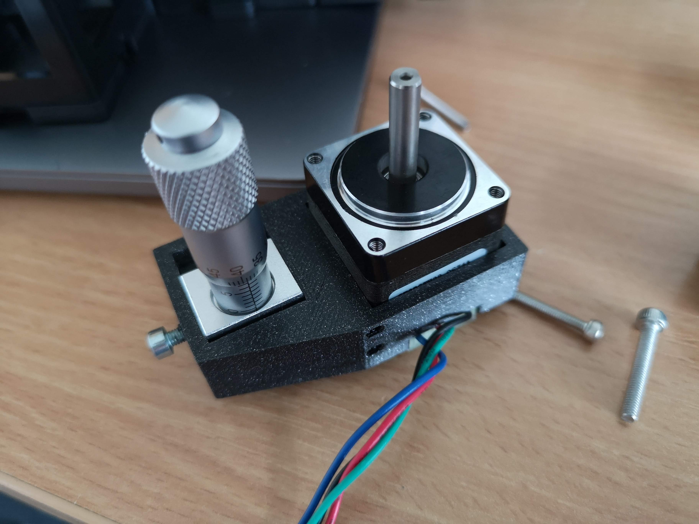

<p align="left">
<a href="#logo" name="logo"></a>
</p>

# openUC2 MicronStage
---


This repository will help you to set up a very simple yet powerful xy-stage for your UC2-based microscope experiments, where manipulating the region of interest (ROI) in X/Y at a micrometer level using NEMA stepper motors becomes important.

The electronics are based on the [GRBL](https://github.com/grbl/grbl)-firmware and can be controlled either through an Arduino Shield (e.g. CNC Shield v3) controlled by a Raspberry Pi/Nvidia Jetson/laptop or a dedicated CNC/3D printing electronics (e.g. MKS CLS). Curious to see what this looks like? Scroll to the very bottom of the page.

<p align="center">
<a href="#logo" name="logo"></a>
</p>


This stage can be used for diffrent experiments. We have successfully used it for Ptychography, where micrometer stage manipulation is of importance. Similarly, we use it for autonomously operating fluorescence microscopes. A complete tutorial can be found in the [core UC2 repository](https://github.com/openUC2/UC2-GIT/tree/master/APPLICATIONS/APP_Fluorescence_Microscope_infinity)

Depending on the settings of the [GRBL](https://github.com/grbl/grbl)-controller you can achieve <1µm resolution with the stage! Adding an additional optical encoder by means of a camera (e.g. Raspicam) + microscope objective lens, the open-loop stage can be used as a closed-loop stage with very high precision. More about this will follow soon!

The overall price is in the range of 300€.


The stage on top of a fluorescence microscope:

<p align="center">
<a href="#logo" name="logo"></a>
</p>


***Features:***

- Move samples plate in XY at high resolution
- NEMA11-based mechanism
- Fast scanning
- Very precise
- Whole setup <300€ in parts
- Easy to assemble
- Limited number of parts (3D printed + off-the-shelf components)
- Minimum of tools required
- Use GRBL as the motion protocol


# Table of Content

- **[Electronics](#Electronics)**
- **[Software](#Software)**
- **[Hardware](#Hardware)**
- **[Bill of materials](#Results)**
- **[Results](#Results)**


## In-Action

You can directly control the microscope from the opentrons Jupyter notebook. We have collected some notebooks showing its control in the folder [./JUPYTER](./JUPYTER). This way it becomes very simple to plan experiments which involve both, pipetting and imaging.

<p align="center">
<a href="#logo" name="logo"></a>
</p>


# SOFTWARE


We offer different ways to control the stage!

## Openflexure

**Warning:** This is still under strong development. We derived the software to control the GRBL-based XYZt stage from the [Openflexure microscope project](https://gitlab.com/beniroquai/openflexure-microscope-server) by Bowman et al.
Instead of using a Raspberry Pi camera, we use an Nvidia Jetson Nano singleboard computer and run a customized version of the OFM server that can control the GRBL board and the monochrome CMOS camera.

A detailed set of instructions for installing the Openflexure Server (OFM Server) can be found in a dedicated [README_SOFTWARE.md](README_SOFTWARE.md) (it is under construction..). In case you want a preinstalled image, please contact us!

## Octopi-Research

We have written a small device adapter for the Ocotopi research developed for the SQUID project from the [PrakashLab](https://squid-imaging.org/7bad36b7a9b44cacb1fe1580b39e05d8).
Please have a look in this [repository](https://github.com/beniroquai/octopi-research)


## Custom Python code

We also provide a small code example for driving the code using a python driver. Please refer to the Jupyter Notebook and the package in the folder [PYTHON](./PYTHON).


# HARDWARE

Below we describe how the XY Stage can be build and assembled in order to replicate the whole system as shown in the rendering above one needs additional parts that can be found in the original [openUC2 repository](https://github.com/bionanoimaging/UC2-GIT).


## Bill of material

Below you will find all components necessary to build this device

### 3D printing files

All these files need be printed. We used a Prusa i3 MK3 using PLA Prusmant (Galaxy Black) at layer height 0.3 mm and infill 80%.


|  Type | Details  |  Price | Link  |
|---|---|---|---|
| Sample Holder |  (optional) Sample holder with lowered base which adapts to XY stage |  0.04 € | [Assembly_XY_stage_with_motors_v3_cellSTORM_UC2_Sample_arm_ptycho.stl](./STL/Assembly_XY_stage_with_motors_v3_cellSTORM_UC2_Sample_arm_ptycho.stl)  |
| Sample Holde | Sample holder with staight base which adapts to XY stage  |  4 € | [Assembly_XY_stage_with_motors_v3_30_XY_Sample_arm_v3.stl](./STL/Assembly_XY_stage_with_motors_v3_30_XY_Sample_arm_v3.stl)  |
| Baseplate | Adapts the XY-stage to the UC2 cubes |  4 € | [Assembly_XY_stage_with_motors_v3_cellSTORM_UC2_Laser_base.stl](./STL/Assembly_XY_stage_with_motors_v3_cellSTORM_UC2_Laser_base.stl)  |
| Motor mount | Adapts the motor to the stage |  4 € | [Assembly_XY_stage_with_motors_v3_30_Mount_Nema_Motor_attachement_for_XYstage_v3.stl](./STL/Assembly_XY_stage_with_motors_v3_30_Mount_Nema_Motor_attachement_for_XYstage_v3.stl)  |
| Gear 2 | Gear for micrometer screw |  4 € | [Assembly_XY_stage_with_motors_v3_cellSTORM_UC2_motorized_micrometer_gear2_1.stl](./STL/Assembly_XY_stage_with_motors_v3_cellSTORM_UC2_motorized_micrometer_gear2_1.stl)  |
| Gear 1 | Gear for motor |  4 € | [Assembly_XY_stage_with_motors_v3_cellSTORM_UC2_motorized_micrometer_gear1_2.stl](./STL/Assembly_XY_stage_with_motors_v3_cellSTORM_UC2_motorized_micrometer_gear1_2.stl)  |

### Additional parts


#### XY Stage from Aliexpress

We tested many different variants, where many were not really reproducible by means of whole positions and linear guiding quality. Finally we decided to buy a couple of these stages and are very happy with them!
The `XY60-C` costs between 40-50€ and compares to a `Thorlabs LX20`stage (820€).

<p align="center">
<a href="#logo" name="logo"></a>
</p>

It is available from this [Aliexpress shop](https://de.aliexpress.com/item/4000801621380.html?spm=a2g0o.productlist.0.0.303b301dvo4AzM&algo_pvid=ca5e3889-75d2-4a53-97d2-df5810ccfbcc&algo_expid=ca5e3889-75d2-4a53-97d2-df5810ccfbcc-2&btsid=2100bb4716119012253526554e7664&ws_ab_test=searchweb0_0,searchweb201602_,searchweb201603). Search for "XY Axis 60*60mm Trimming Station Manual Displacement Platform Linear Stage Sliding Table XY60-C XY60-R,XY60-LM LY60 Cross Rail"


From the website the following information are available:

***Feature:***

```
1. Using mobile cross roller guides, enabling high-precision, smooth
2. The main body made of aluminum alloy, light weight, suitable to be built for other devices
```

***Parameter:***
```
1. Direction of movement: X Y axis direction
2. Body material: Aluminum
3. Drive: differential head
4. The table size: 60x60mm
5. table thickness: 36mm/30mm
6. Stroke: ± 6.5mm（Customizable ±12.5,if you need,contact us）
7. Load: 49N (5kgf)
8. Minimum scale: 0.01mm
9. Accuracy class: 0.01mm
10. Parallelism: 0.06mm
11. Weight: 0.48kg
```

#### Additional parts

This is used in the current version of the setup

|  Type | Details  |  Price | Link  |
|---|---|---|---|
| MKS DLC CNC  (NEMA Motors) | Controller Electronics for NEMA motors and Laser |  25 € | [Roboter-Baukasten](https://www.roboter-bausatz.de/p/mks-dlc-cnc-lasergravierer-mainboard-grbl)  |
| M3, M4 Screws | Screw Set |  12 € | [Ebay](https://www.ebay.de/itm/Schrauben-Set-520tlg-Edelstahl-Schrauben-Muttern-M3-M4-M5-Linsenkopfschrauben/383726480774?_trkparms=ispr%3D1&hash=item5957e16d86:g:G5sAAOSwVFpfZIpI&amdata=enc%3AAQAFAAACcBaobrjLl8XobRIiIML1V4Imu%252Fn%252BzU5L90Z278x5ickkxFtV7J5P58ubuVigtBH%252Fe6pb1LxAKCnCULXdvRrl4LVsR3MjfE7wqRxrrBJlBysxXCQuNVptPKS9BmNaHKDLIeQv9NKj6IvrJW%252FufTTddFXGF8U%252BnasvpahEx2Fwxrry8XZyS4eQQvsN4mA59aRp9J7k6D4K06%252FFcobu4rHnfQ1VDPT8wflsYId3xtETX7pohjCj3dUHx%252B2xdTjlELu04rULIiL6TUEAeM14OltNcoB1t2%252Fh8V8LKjZEnZdlr%252F%252FRXMuJEQYYDBP%252BBnRL5njzYMyjhWI4zWNk15%252BO1Dp35UhzgbADwjZ0qAo99s3c3Ti6IYmF969jgsb%252BGsP1O7z0Hr%252BpldAp1SHfquGj6eFoy%252FGQNJEId0Py85H1LaFn6Hyci2zHqyBgOacd3mquWr7LNT%252F%252FwpC%252FdQKhGyC2IC0Em1d%252BmmZ6ooQu3vmdiJsgBl3Xo3aLS%252BgW8Wt9gV9q8CMkm20NLpQ6jZyrsf%252FIuilQiHFyzw1J4VLI9n0%252BL6%252FBAH3YJmF%252B73OfglDgtfXR6JsIfmQWs%252FZHZiL3amLq0SmiL8EMrSxXt%252BIJ%252BiGbRoPXdxz3szICKQI4q9q%252FD722ZzcNie8%252FzhMVivT30E1KgYJfz%252FAfU7gvNCXLVDGSFbcWoPzhKkeHwScOm%252BdH7lynZeiltxRDBO87crSnuH9QoeU7MYThFdOChZ32I32GDoDan46MhW38X80oeXGp6BhDrkOgATOEQNgh3vOFRSl5P2ew7vYL%252Bv4da0aJy2ThL5WfIGHbt9qjkwQjEBY4JexecOA7qQ%253D%253D%7Ccksum%3A38372648077480f9cf3eb2fe485292adf88c008d37c8%7Campid%3APL_CLK%7Cclp%3A2334524)  |
| yourDroid Netzteil 12V 3A 5,5x2,1mm DC-Stecker | Power  Supply 12V |  6,45 € | [Roboter-Baukasten](https://www.roboter-bausatz.de/)  |
| 3x A4988 Schrittmotorentreiber	RBS10232 | Stepper Driver |  0,99 € | [Roboter-Baukasten](https://www.roboter-bausatz.de/)  |
| Spring | Diameter: 5mm, 15mm long |  0,99 € | [Roboter-Baukasten](https://www.roboter-bausatz.de/)  |
| Nema11 Motor | Steppermotor |  23 € | [Eckstein](https://eckstein-shop.de/Pololu-Stepper-Motor-NEMA-11-Bipolar-200-Steps-Rev-2832mm-38V-067-A-Phase?googlede=1&gclid=CjwKCAjwt8uGBhBAEiwAayu_9RS_iMYwnM_VgrfcgmLqs704zZQY-b2VWR5-eBRE5AVzxxMusdWiwhoCMqwQAvD_BwE)  |


### Assembly of the XY Stage

***1.*** *These are the parts needed for the XY-stage*

<p align="center">
<a> </a>
</p>

***2.*** *Start by removing the micrometer with the screws for one axis*

<p align="center">
<a> </a>
</p>

***3.*** *Try to add something which blocks the rail from snapping back (e.g. screwdriver)*

<p align="center">
<a> </a>
</p>

***4.*** *Add the micrometer screw to the motor adapter ad add a screw at a side to mount it (M3x8mm)*

<p align="center">
<a> </a>
</p>

***5.*** *Add the motor motor adapter*

<p align="center">
<a> </a>
</p>

***5.1 (optional)*** *Add M3 screws to have a better mounting of the motor*

<p align="center">
<a> </a>
</p>


***6.*** *Mount the gears*

<p align="center">
<a> </a>
</p>

***6.1*** *Fix the gears with screws (M3 - headless)*
<p align="center">
<a> </a>
</p>


***7.*** *Mount the assembly back on the XY-stage with the M2.5 screws*

<p align="center">
<a> </a>
</p>

***7.1*** *Does it look like this?*
<p align="center">
<a> </a>
</p>

***8.*** *Repeat it for the second axis and mount the sample adapter (M4)*

<p align="center">
<a> </a>
</p>

***9. (optional)*** *Add the baseplate to the XY-stage - but don't forget to also screw the UC2 puzzle-piece baseplates to the baseplate*

<p align="center">
<a> </a>
</p>


## Showcase

Some results will show up here soon.

<p align="center">
<a> </a>
</p>

***Fig 1.*** *Some fluorescent cells (HeLa) moved in XY/Z This is actually a very bad example ;-)*


<p align="center">
<a> </a>
</p>

***Fig 2.*** *Some Ptychography measurements of a USAF chart scanned through a beam*


## Get Involved

This project is open so that anyone can get involved. You don't even have to learn CAD designing or programming. Find ways you can contribute in  [CONTRIBUTING](CONTRIBUTING.md)


## License and Collaboration

This project is open-source and is released under the CERN open hardware license. Our aim is to make the kits commercially available.
We encourage everyone who is using our Toolbox to share their results and ideas, so that the Toolbox keeps improving. It should serve as a easy-to-use and easy-to-access general purpose building block solution for the area of STEAM education. All the design files are generally for free, but we would like to hear from you how is it going.

You're free to fork the project and enhance it. If you have any suggestions to improve it or add any additional functions make a pull-request or file an issue.

Please find the type of licenses [here](./License.md)

REMARK: All files have been designed using Autodesk Inventor 2019 (EDUCATION)


## Collaborating
If you find this project useful, please like this repository, follow us on Twitter and cite the webpage! :-)
